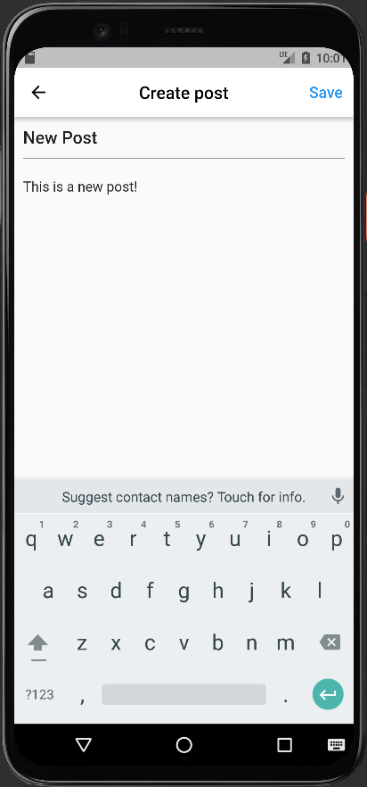

# MobX
# ```Terminal```
- flutter clean
- flutter pub get
- flutter packages pub run build_runner build --delete-conflicting-outputs

# ```Add the following to each controller page```
- import 'package:mobx/mobx.dart';
- part 'PAGENAME_store.g.dart';
- class CLASSNAMEStore = _CLASSNAMEStore with _$CLASSNAMEStore;
- abstract class _CLASSNAMEStore with Store {}

# ```In order to observe the changes```
- @observable DataType VaribaleName = InitialValue;

# ```pubspec.yaml```
> ```Add the followings under the dependencies: ```
> - mobx: latest_version
> - flutter_mobx: latest_version
> 
> ```Add the followings under the dev_dependencies: ```
> - build_runner: latest_version
> - mobx_codegen: latest_version


| Main Page | Create Page | Edit Page |
|----------------|:----------------:|:----------------:|
|  |  |  |
